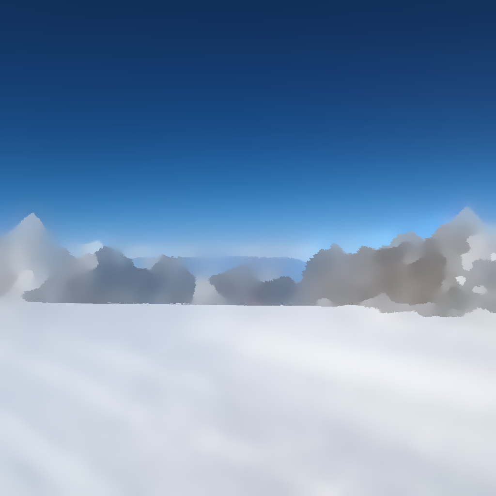
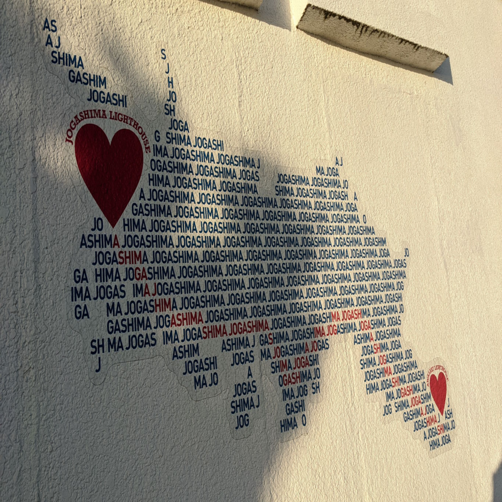

# Pyramid-Texture-Filtering (SIGGRAPH 2023)

	@article{zhang2023pyramid,
		title={Pyramid texture filtering},
		author={Zhang, Qing and Jiang, Hao and Nie, Yongwei and Zheng, Wei-Shi},
		journal={arXiv preprint arXiv:2305.06525},
		year={2023}
	}

## なぜこの論文が重要か
### 技術的コアは何か
本論文では，画像に含まれるストラクチャを保持しつつ，テクスチャを除去するテクスチャフィルタリングがテーマになっている。
筆者らは，画像の解像度を下げていくと次第にテクスチャが薄まっていき，元画像のストラクチャだけが残るという観察結果を得た。
そこで，画像にダウンサンプリングとアップサンプリングを施すことで，単純な画像処理のみを用いて，テクスチャフィルタリングを実現した。

しかし，ただアップサンプリングを施すだけでは，元画像に含まれたシャープなストラクチャを再現することができない。
そこで，筆者らは Gaussian Pyramid と Laplacian Pyramid を同時に用いて Joint Bilateral Filter (JBF)，アップサンプリングを施す手法を提案した。
これにより，アップサンプリングの中で元画像のシャープなストラクチャが消失する問題を解決し，安定したテクスチャフィルタリングを実現した。

Gaussian Pyramid では，元画像からダウンサンプリングを繰り返し，元画像とダウンサンプリングされた画像からなるピラミッドを構成する。
ダウンサンプリングの際は，まず画像をガウシアンフィルタでぼかし，そのぼかした画像をダウンサンプリングにより半分のサイズにする。

Laplacian Pyramid 生成の際は，まず Gaussian Pyramid を構築し，各レベルの Gaussian Pyramid 画像を高解像度のレベルにアップサンプリングする。
アップサンプリングされた画像と，対応する高解像度レベルの Gaussian Pyramid 画像との差分を取る。
この差分画像が，Laplacian Pyramid の各レベルにおける画像となる。
Laplacian Pyramid では，Gaussian Pyramid 構成の際に行われるダウンサンプリングで失われる情報を保持している。
これにより，画像のエッジや詳細なストラクチャを保持することができ，これらの情報によりアップサンプリングの際に元画像のシャープなストラクチャを表現することができる。

JBF では，ガイド画像を用いることで，対象画像のエッジを保ちながらノイズを除去することができる。
本論文では画像のアップサンプリングの際に，JBF を用いる。
アップサンプリングの際は，アップサンプリング元を対象画像，Gaussian Pyramid 中の対応する画像をガイド画像として JBF を施す。
続いて，元画像のシャープなストラクチャを表現するために，Laplacian Pyramid を用いた画像処理を施す。
アップサンプリングされた画像と Laplacian Pyramid 中の対応する画像の和をガイド画像，アップサンプリングされた画像を対象画像として JBF を施す。
この JBF を用いたアップサンプリングと JBF を用いたフィルタリングを繰り返すことで，テクスチャフィルタリングが施された画像を得ることができる。

### なぜこの論文が採択されたか
テクスチャフィルタリングは依然難易度が高いタスクである。
なぜならば，テクスチャとストラクチャは非常に似通っており，それらの違いを見つけることは容易ではないからである。
従来の手法では，テクスチャを除去する際に，全体としてブラーがかかったり，境界部分に新たなアーティファクトが発生していた。
しかし，ガウシアンピラミッドとラプラシアンピラミッドを用いて，ダウンサンプリングとアップサンプリングを行う本手法では，そのようなブラーやアーティファクトを出現させることなくテクスチャフィルタリングを施せる。

また，本手法では事前にモデルを学習させることや境界を指定する必要はなく，ダウンサンプリングとアップサンプリングによる簡単な画像処理のみで高精度なテクスチャフィルタリングを実現できる。
加えて，ガウシアンピラミッドとラプラシアンピラミッドを用いたテクスチャフィルタリングでは，JBFのハイパーパラメータのみを指定すればよく，従来手法よりも扱いやすい。

## 何を実装したか
ダウンサンプリングとアップサンプリングを施し，テクスチャフィルタリングを実現するパイプライン全体を C++ で実装した。

まず，Gaussian Pyramid と Laplacian Pyramid を構築するアルゴリズムを実装した。
それぞれの Pyramid 構築の際は，Gaussian Filter によるスムージングと Bilinear Interpolation によるアップサンプリングを施す必要がある。
そこで，Gaussian Filter と Bilinear Interpolation の実装を行った。

続いて，Joint Bilateral Filtering を用いたアップサンプリングを実装した。
具体的には，Pyramid 構築において実装した Bilinear Interpolation と新たに実装した Joint Bilateral Filtering によってアップサンプリングを施した。

Gaussian Pyramid によるダウンサンプリングと，Gaussian Pyramid，Laplacian Pyramid，Joint Bilateral Filtering によるアップサンプリングにより，提案手法全体のパイプラインを実装した。

## 実験結果
以下は，実装したパイプラインによるテクスチャフィルタリングの結果である。
提案手法のパイプラインでは，Joint Bilateral Filtering のパラメータが存在するが，それらは $\sigma_s = 9.0, \sigma_r = 0.09$ として実験を行った。
実験では，自身が撮影した実世界の画像を $960 \times 960$ にリサイズして用いた。

出力画像では，入力画像中のストラクチャを保持しつつ，細かいテクスチャが除去されていることが見て取れる。
しかし，出力画像の詳細部分を見るといくつか問題点があることが分かる。
例えば，Image 1 の鳥が移っている箇所，Image 4 の画像中心部分，Image 5 の鉄塔や煙突部分はブラーが生じており，Image 3 のハート下部のストラクチャが欠けてしまっている。

<table style="text-align: center;">
	<tr>
		<td></td>
		<td>入力画像</td>
		<td>出力画像</td>
	</tr>
  <tr>
		<td>Image 1</td>
    <td></td>
    <td></td>
  </tr>
  <tr>
		<td>Image 2</td>
    <td></td>
    <td></td>
  </tr>  
	<tr>
		<td>Image 3</td>
    <td></td>
    <td></td>
  </tr>
  <tr>
		<td>Image 4</td>
    <td></td>
    <td></td>
  </tr>
  <tr>
		<td>Image 5</td>
    <td></td>
    <td></td>
  </tr>
</table>

